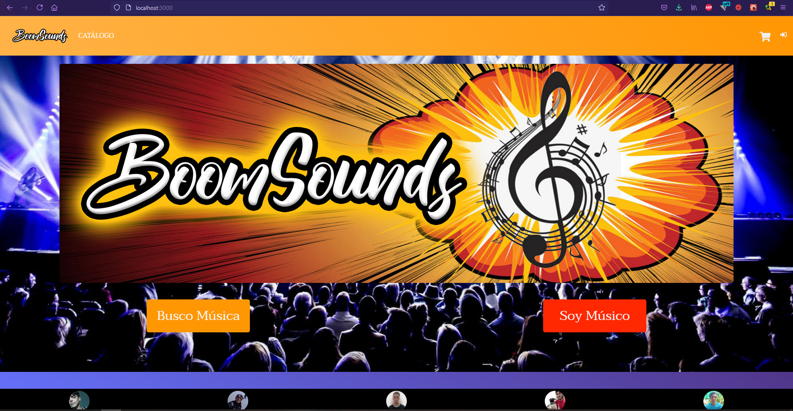
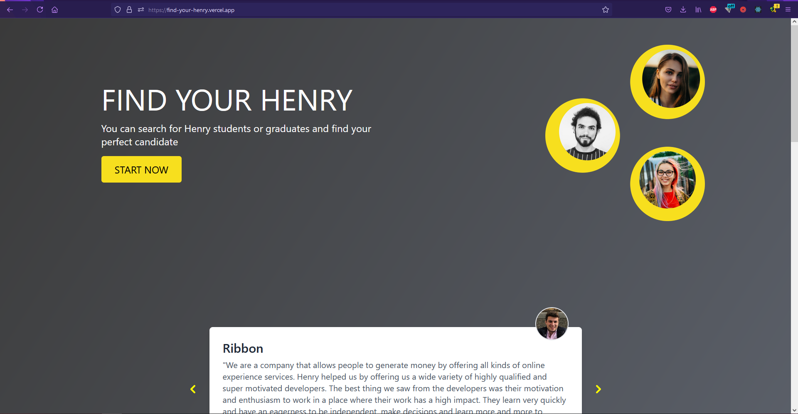

<h1>Hello there! I'm Federico 👋</h1>

<!--
**fhtallarico/fhtallarico** is a ✨ _special_ ✨ repository because its `README.md` (this file) appears on your GitHub profile.

Here are some ideas to get you started:

- 🔭 I’m currently working on ...
- 🌱 I’m currently learning ...
- 👯 I’m looking to collaborate on ...
- 🤔 I’m looking for help with ...
- 💬 Ask me about ...
- 📫 How to reach me: ...
- 😄 Pronouns: ...
- ⚡ Fun fact: ...
-->
  <h2>🤔 About me:</h2>
  
I'm a Full Stack Developer from Buenos Aires, Argentina, looking to make my way into the IT job market, I'm passionate about technology and learning new things. I have experience working in teams and i'm easily adaptable to new projects and challenges.

  
<h2>⭐ Languages and Tools:</h2>

         
    
  
  

<h2>📌 My proyects:</h2>

<h3>E-commerce Boomsounds</h3>

  

<h3>Find your Henry</h3>

  

<h2>📫 How to reach me:</h2>

   
https://www.linkedin.com/in/federico-horacio-tallarico/

   
fh.tallarico@gmail.com

